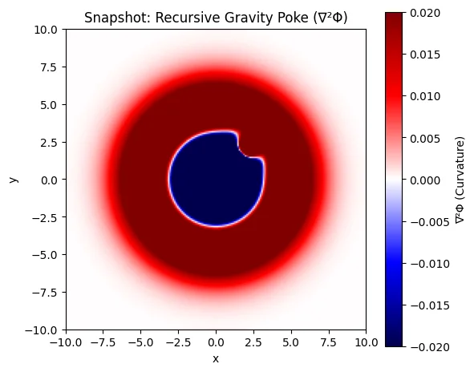

# Intent Tensor Theory: Gravity

> **Recursive Gravity Functional / Planck Scale Gravity**  
> *A Collapse Geometry Framework for Intentional Gravity Modulation*

[](https://colab.research.google.com/github/intent-tensor-theory/0.0_Gravity/blob/main/simulations/poke_gravity_here.ipynb)

---

## 🌀 What Is This?

This repository contains the **gravity framework** of [Intent Tensor Theory](https://intent-tensor-theory.com/) — a novel recursive framework wherein gravitational phenomena emerge not from pre-existing mass-energy curvature, but from coherent scalar intention fields that recursively contract into shell structures.

**Key Innovation**: We demonstrate the first simulated **"poke" of gravity** — a time-localized intentional modulation that perturbs recursive curvature memory and elicits a visible reaction in the Laplacian signature ∇²Φ.

---

## 📸 The Gravity Poke



**What you're seeing:**
- 🔵 **Blue Core**: High negative curvature — the recursion center
- 🔴 **Red Ring**: Positive curvature pushback — shell re-alignment  
- ⚪ **Sharp Edge**: Recursive shell boundary under modulation

---

## 🧮 Core Equations

### The Collapse Genesis Stack
```
Φ → ∇Φ → ∇²Φ → ρ_q
```

| Glyph | Meaning |
|-------|---------|
| **Φ** | Scalar potential: latent intent |
| **∇Φ** | Collapse vector: direction of recursive flow |
| **∇²Φ** | Curvature lock: stabilization of memory |
| **ρ_q** | Charge density: emergent shell (gravity, matter) |

### The Poke Equation
```
Φ(x,y,t) = Φ₀ + ε·sin(ωt)·G(x,y)
```

### End Equation: Recursive Gravity Functional
```
g⃗(x,t) = −κ_g [∇𝒜(x,t)·Tr(ℳ(x,t)) + 𝒜(x,t)·∇Tr(ℳ(x,t))]
```

Where:
- **κ_g = ℏc/m²_Pl** (Planck coupling constant)
- **𝒜** = Alignment Functional
- **ℳ** = Memory Tensor

---

## 🧪 Interactive Notebooks

Run the simulations yourself:

| Notebook | Description | Launch |
|----------|-------------|--------|
| [poke_gravity_here.ipynb](simulations/poke_gravity_here.ipynb) | 0D→4D progression with animated pokes | [](https://colab.research.google.com/github/intent-tensor-theory/0.0_Gravity/blob/main/simulations/poke_gravity_here.ipynb) |
| [proof_of_poke_gravity.ipynb](simulations/proof_of_poke_gravity.ipynb) | Theoretical validation & advanced sims | [](https://colab.research.google.com/github/intent-tensor-theory/0.0_Gravity/blob/main/simulations/proof_of_poke_gravity.ipynb) |

---

## 📚 Documentation

| Document | Description |
|----------|-------------|
| [gravity.md](docs/gravity.md) | Full Planck Scale Gravity treatise |
| [poke-gravity.md](docs/poke-gravity.md) | How to "Poke" Gravity framework |

---

## 🎯 Hypothesis

**A localized, time-varying modulation of a scalar intent field Φ(x, y, t) = Φ₀(x, y) + ε·sin(ωt)·G(x, y), when applied to a recursive gravity shell, will produce a measurable re-alignment in the Laplacian signature ∇²Φ, detectable as a distinct curvature perturbation independent of mass or energy input.**

**Testable Prediction**: The curvature perturbation should be observable using sensitive gravitational detectors (e.g., advanced interferometers or atom interferometry) without requiring a mass source.

---

## 🔗 Links

- **Website**: [intent-tensor-theory.com/gravity](https://intent-tensor-theory.com/gravity/)
- **Poke Gravity**: [intent-tensor-theory.com/gravity/poke-gravity](https://intent-tensor-theory.com/gravity/poke-gravity/)
- **Coordinate System**: [intent-tensor-theory.com/coordinate-system](https://intent-tensor-theory.com/coordinate-system/)
- **Code Equations**: [intent-tensor-theory.com/code-equations](https://intent-tensor-theory.com/code-equations/)

---

## Quick Start

```python
import numpy as np
import matplotlib.pyplot as plt

# Grid and base potential
L, N = 10, 200
x = np.linspace(-L, L, N)
X, Y = np.meshgrid(x, x)
Phi_0 = np.exp(-0.1 * (X**2 + Y**2))

# Poke setup
epsilon, omega, t = 0.05, 2*np.pi/50, 30
G = np.exp(-((X-2)**2 + (Y+2)**2))
Phi_t = Phi_0 + epsilon * np.sin(omega * t) * G

# Laplacian (curvature response)
laplacian = (np.roll(Phi_t,1,0) + np.roll(Phi_t,-1,0) + 
             np.roll(Phi_t,1,1) + np.roll(Phi_t,-1,1) - 4*Phi_t) / (x[1]-x[0])**2

plt.imshow(laplacian, cmap='seismic', extent=(-L,L,-L,L), vmin=-0.02, vmax=0.02)
plt.colorbar(label='∇²Φ (Curvature)')
plt.title('Recursive Gravity Poke')
plt.show()
```

---

*By Armstrong Knight & Sensei–Intent–Tensor™*

**Intent Tensor Theory — Cyberphysics Laboratory**
